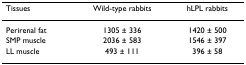
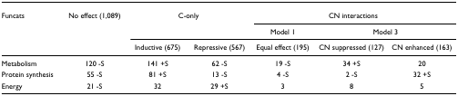
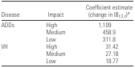

# PubTabNet Playground
_A rule-based approach to paring tabular data from images._

### What is table parsing?
Loosely speaking the objective of a table parsing algorithm is to convert an image of a table, extracted from a scanned document for example, into
a csv.

Tissues, Wild-type rabbits, hLPL rabbits, 
Perirenal fat, 1305±336, 1420±500, 
...

### Why is table parsing?
The need for a fully optical table parsing algorithm is part of a larger need for a fully optical document parsing engine. Say, for example,
there is a pdf document of a textbook, but it is just a collection of scanned images. It would be great if there was a way to search for keywords within that document. Indeed this technology does exist and has existed for quite some time. This capability can be obtained using Optical Character Recognition (OCR) which has been commonly available since the 1970s. The information age has brought with it a host of fancy Natural Language Processing (NPL) utilities such as entity recognition, text summarization, etc. Our ability to apply connect these two technologies together, i.e. applying NLP utilities on the words found within a scanned document, however, has remained an elusive target for a number of reasons that I won't go into directly. However, many of the principle roadblocks with regards to parsing tabular data from images share commonalities with those of parsing documents in general.

### Who is table parsing?
For the purposes of this task, tables can categorized into one of four groups; good, bad, twice as bad, and slightly worse. The example above is a good one. Here is a bad table.

What is wrong with this table is the existance of multiple column headers. I.e., "Model 1" and "Model 3" are sub-columns of "CN Interactions". Here is another bad example. In this example, there are rows which should be interpreted as subcategories of other rows.

Naturally, the twice as bad category refers to tables which have both multi-columns and multi-rows. The final category "slightly worse" refers to tables which are slanted. Here is a figure from "Rethinking Table Recognition using Graph Neural Networks" (Qasim) which includes all four (and is the source of this categorization methodology)

This categorization is an artifact of traditional methods for parsing tables which can be summarized as; Perform OCR on the image to determine the coordinates of the data values and fit the values to a cartesian grid. Qasim proposes an ingeneous algorithm which bypasses the roadblocks associated with fitting non-grid-like items to a grid, by reformulating the problem into one of relationship prediction. Unfortunately, I found this paper quite late in my research and did not have time to experiment with the proposed model, so this article is my best attempt at solving a the problem using the traditional thought process; find the data values, fit them to a grid.

### When is table parsing?
In 2020, IBM released PubTabNet, a dataset aimed at solving this problem once and for all. The dataset consists of images of tables as the input. The target is the XML used to generate each image, which is a bit tricky to work with but still usable. Well get to that soon enough, but now that the groundwork has been laid we can get into the code.

### The code
